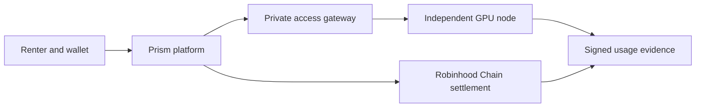

  

<h1 align="center">Prism Network</h1>

  Open infrastructure for metered GPU compute.

Prism Network connects renters to independent NVIDIA capacity through isolated
Kata workspaces, short-lived SSH or Jupyter access, and metered USDG settlement
on Robinhood Chain.

## Projects

| Project | Purpose |
| --- | --- |
| [`prism`](https://github.com/prismnetwork-tech/prism) | Marketplace, control plane, access gateway, settlement workers and web application |
| [`prism-protocol`](https://github.com/prismnetwork-tech/prism-protocol) | Signed node messages, shared wire types and public receipt specification |
| [`prism-node`](https://github.com/prismnetwork-tech/prism-node) | Supplier node daemon, Kata/VFIO runtime, host validation and service units |
| [`prism-contracts`](https://github.com/prismnetwork-tech/prism-contracts) | USDG bond, lease escrow and administration contracts |

## Current status

Prism is pre-production software. The local lifecycle is implemented and
tested, but funded public use remains blocked on physical NVIDIA/Kata/VFIO
validation, production credentials, operational drills and independent
security review.

Independent suppliers are not trusted computing environments. Do not use the
network for confidential workloads, regulated data, valuable model weights or
production funds.

## Participate

- Read the [architecture](https://github.com/prismnetwork-tech/prism/blob/main/docs/ARCHITECTURE.md).
- Review the [security model](https://github.com/prismnetwork-tech/prism/blob/main/docs/SECURITY_MODEL.md).
- Open focused issues and proposals in the relevant repository.
- Report vulnerabilities through the affected repository's private
  vulnerability-reporting channel.

Website: [prismnetwork.tech](https://prismnetwork.tech)
